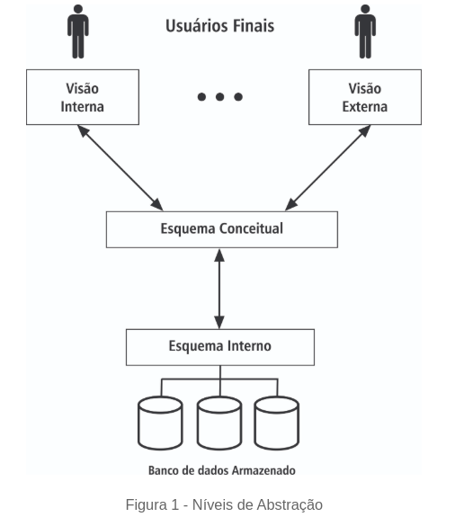

# 30/01/2024 - BANCO DE DADOS FUNDAMENTOS - IFRS - DAY 1

# 1 - Conceitos fundamentais

# 1.1 Introdução 

# 1.2 História 
- 
- Surgiram na década de 1960 para resolver limitações no armazenamento de dados.
- IBM desenvolveu o modelo relacional e a linguagem SQL (1970).
- Evolução para atender às necessidades modernas de gerenciamento.

# 1.3 Usuários de Bancos de Dados

1. **DBA (Administrador)**: gerencia segurança e desempenho.
2. **Analista de Bancos de Dados**: projeta e estrutura os dados.
3. **Usuários Finais**: acessam e manipulam dados.
4. **Programadores**: implementam transações e soluções.

# 1.4 Níveis de Abstração
1. **Nível Externo**: visões específicas para diferentes usuários.
2. **Nível Conceitual**: estrutura lógica geral.
3. **Nível Interno**: organização física.

# 1.5 SGBD - Sistema Gerenciadores de Bancos de dados

# 1.6 Video complementar 1: Conceitos fundamentais sobre banco de dados

# 1.7 Video complementar 2: Conceitos fundamentais sobre banco de dados

# 1.8 Teste seus conhecimentos

# O que é uma Entidade em Banco de Dados?

Em **banco de dados**, uma **entidade** é um conceito fundamental que representa um objeto ou elemento do mundo real que queremos armazenar e gerenciar informações.

## Características Principais
1. **Representação do Mundo Real:**  
   A entidade geralmente corresponde a um objeto ou conceito concreto ou abstrato, como uma pessoa, produto, pedido, carro, etc.
   
2. **Armazenamento de Dados:**  
   Cada entidade armazena **atributos** (ou propriedades) que descrevem as suas características.  
   Exemplo: Uma entidade **Cliente** pode ter os atributos `nome`, `endereço`, `telefone` e `data de nascimento`.

3. **Unicidade:**  
   Cada entidade pode ser identificada de forma única por uma **chave primária**, que é um ou mais atributos que garantem que não haverá duplicidade nos dados.

---

## Exemplo
Imagine um sistema de gerenciamento de biblioteca. Algumas entidades poderiam ser:
- **Livro** (atributos: título, autor, ISBN, ano de publicação)
- **Usuário** (atributos: nome, matrícula, endereço)
- **Empréstimo** (atributos: data do empréstimo, data de devolução, id do livro, id do usuário)

---

## Tipos de Entidades
1. **Entidade Forte:**  
   É uma entidade que pode ser identificada de forma independente, ou seja, ela possui sua própria **chave primária**.  
   **Exemplo:** Um **Aluno** com os atributos `matrícula` (chave primária), `nome`, `curso`.

2. **Entidade Fraca:**  
   É uma entidade que não possui uma chave primária própria e depende de uma entidade forte para ser identificada. Geralmente, ela é associada a uma **chave estrangeira** de outra entidade.  
   **Exemplo:** Uma **Parcela** de pagamento que depende do identificador do **Pagamento** principal.

---

## Representação no Modelo Entidade-Relacionamento (MER)
No **Modelo Entidade-Relacionamento (MER)**, as entidades são representadas como **retângulos**, e seus atributos são ligados a elas por meio de **elipses**.  

Por exemplo:
- Retângulo "Cliente" terá elipses "Nome", "CPF", "Telefone".

---

## Resumo
- Uma **entidade** representa um objeto ou conceito do mundo real.
- Contém **atributos** que descrevem suas características.
- Possui uma **chave primária** para identificação única.
- Pode ser classificada como **forte** ou **fraca**.
- É essencial no design de bancos de dados, tanto na fase lógica quanto na física.

# Resumo: Conceitos e Arquiteturas de Banco de Dados

## Níveis de Abstração no Banco de Dados
1. **Camada Externa**: interface com o usuário; consultas e operações.
2. **Camada Lógica**: estrutura lógica criada pelo SGBD.
3. **Camada Física**: armazenamento no disco.

## Modelo Relacional
- Relaciona entidades como conjuntos.
- Amplamente utilizado pela facilidade de uso, segurança e eficiência.

## Arquiteturas de Banco de Dados
1. **Centralizada**: único banco em um mainframe.
2. **Computador Pessoal**: banco local no PC.
3. **Cliente-Servidor**: servidor central armazena e processa dados.
4. **Distribuído**: dados espalhados por vários servidores.

---

---

---

# 1.4 Resumo: Níveis de Abstração e Benefícios do SGBD

## Benefícios
- Controle de redundância.
- Compartilhamento consistente de dados.
- Controle de acesso para diferentes níveis de permissão.

---

# Conclusão
Os bancos de dados e os SGBDs são fundamentais para gerenciar informações de forma estruturada e eficiente. Eles abstraem detalhes técnicos, garantem segurança e permitem o acesso a múltiplos usuários de forma organizada.

# Questionário sobre Bancos de Dados e Sistemas Gerenciadores

## 1. O que é um Banco de Dados (BD)?
**Resposta:**  
É uma coleção logicamente coerente de dados com significado inerente, projetada para armazenar informações relacionadas e refletir alterações no mundo real (minimundo).

---

## 2. Quais são os principais objetivos de um Sistema de Gerenciamento de Bancos de Dados (SGBD)?
**Resposta:**  
- Fornecer um ambiente eficiente para armazenar, recuperar e gerenciar informações.  
- Controlar redundâncias.  
- Compartilhar dados.  
- Gerenciar acessos e abstrair representações dos dados.

---

## 3. Qual a diferença entre dado, informação e conhecimento?
**Resposta:**  
- **Dado:** Elemento bruto, sem significado imediato.  
- **Informação:** Dado processado que possui sentido.  
- **Conhecimento:** Conjunto de informações organizadas e compreendidas.

---

## 4. Quais são os níveis de abstração de um banco de dados e suas funções?
**Resposta:**  
1. **Nível Externo:** Representa a visão dos dados pelos usuários e aplicações.  
2. **Nível Conceitual:** Descreve a estrutura lógica do banco de dados, ocultando detalhes físicos.  
3. **Nível Interno:** Trata da organização física e caminhos de acesso aos dados.

---

## 5. Quem são os usuários de um banco de dados e quais suas funções?
**Resposta:**  
- **Administrador de Banco de Dados (DBA):** Gerencia o banco, controla acesso e desempenho.  
- **Analista de Bancos de Dados:** Projeta e estrutura os dados.  
- **Usuários Finais:** Consultam, modificam e geram relatórios.  
- **Analistas e Programadores:** Desenvolvem e implementam transações.

---

## 6. Quais são as principais funções de um SGBD?
**Resposta:**  
- Inserir, alterar, excluir e consultar dados.  
- Garantir integridade e segurança dos dados.  
- Controlar concorrência para múltiplos usuários.  
- Gerenciar acesso de forma eficiente e abstrata.

---

## 7. O que significa "minimundo" em relação aos bancos de dados?
**Resposta:**  
É a parte do mundo real que o banco de dados representa, refletindo suas alterações e mantendo coerência com a realidade.

---

## 8. Explique as características de um SGBD.
**Resposta:**  
- **Autocontenção:** Armazena dados e metadados.  
- **Independência de Dados:** Os dados não dependem das aplicações que os acessam.  
- **Abstração:** Usuários interagem com os dados sem conhecer detalhes de armazenamento.  
- **Controle de Transações:** Garante a integridade do banco em operações.  
- **Controle de Concorrência:** Gerencia acessos simultâneos ao banco.

---

# 2 - Modelos de Dados e Modelagem de Bancos de Dados

## 1. Modelos de Dados
Os Sistemas Gerenciadores de Bancos de Dados (SGBDs) surgiram para resolver limitações dos sistemas baseados em arquivos. Eles adotam diferentes modelos de dados, que determinam como as informações são organizadas, acessadas e manipuladas. Os principais modelos incluem:

### 1.1 Modelo Hierárquico
- **Estrutura em forma de árvore**, com registros organizados em hierarquias de pai-filho.
- Cada nó (registro) tem:
  - **Campos** (atributos) que armazenam informações.
  - **Relacionamentos** com outros registros (pai-filho), sempre na proporção 1:N (um pai pode ter vários filhos).
- **Características principais**:
  - Dados são acessados na ordem hierárquica, percorrendo a árvore do topo às folhas.
  - Problemas: replicação de dados (causa inconsistência) e desperdício de espaço.
- **Exemplo**: Uma agência bancária como pai pode ter vários clientes como filhos; os clientes podem ter várias contas.

### 1.2 Modelo em Rede
- Extensão do modelo hierárquico que elimina a hierarquia rígida.
- Registros são organizados como grafos, permitindo:
  - Relacionamentos 1:N e também N:N.
  - Acesso direto a qualquer registro, sem a necessidade de começar pela raiz.
- **Vantagem**: Modelagem mais próxima da realidade, com menos restrições.
- **Desvantagem**: Substituído pelo modelo relacional devido à sua complexidade.
- **Exemplo**: Equipamentos com várias bombas e motores, todos podendo sofrer manutenção mecânica ou elétrica.

### 1.3 Modelo Orientado a Objetos
- Representa os dados como coleções de objetos, similares aos utilizados em programação orientada a objetos.
- **Objetos possuem**:
  - **Propriedades** (atributos) que descrevem suas características.
  - **Métodos** (operações) que definem seu comportamento.
- Aplicado mais como um modelo conceitual do que em implementações práticas.

## 2. Modelagem de Dados
A modelagem de dados é o processo de criar representações conceituais da estrutura de um banco de dados. O Modelo Entidade-Relacionamento (MER) é amplamente usado por sua proximidade com a visão do usuário.

### 2.1 Componentes do MER
- **Conjunto de Entidades**: Representam objetos no mundo real (ex.: cliente de um banco).
- **Conjunto de Atributos**: Definem características das entidades. Exemplo: atributos de um cliente podem ser "nome" e "CPF".
- **Conjunto de Relacionamentos**: Associações entre entidades. Exemplo: relação entre clientes e contas bancárias.
- **Cardinalidade**: Determina o número mínimo e máximo de entidades relacionadas. Exemplos:
  - 0:N: Um cliente pode ter nenhuma ou várias contas.
  - 1:1: Um departamento pode ter apenas um gerente.

### 2.2 Diagramas Entidade-Relacionamento (DER)
- Usados para representar graficamente o MER.
- **Elementos**:
  - Retângulos: Conjuntos de entidades.
  - Elipses: Atributos.
  - Losangos: Relacionamentos.
  - Linhas: Conexões entre os elementos.

### 2.3 Processo de Modelagem
1. **Coleta de requisitos**: Identificar as necessidades do banco de dados.
2. **Modelo conceitual (MER)**: Criar o diagrama de entidades e relacionamentos.
3. **Modelo lógico (relacional)**: Converter o diagrama em tabelas.
4. **Implementação no SGBD**: Inserir as tabelas no sistema, como o MySQL.

## 3. Modelo Relacional
O modelo relacional é o mais amplamente utilizado, devido à sua simplicidade e flexibilidade. Ele representa os dados como tabelas bidimensionais, nas quais:
- **Linhas (tuplas)**: Representam instâncias de dados.
- **Colunas (atributos)**: Definem as características de cada entidade.
- **Esquema**: Estrutura das tabelas, composta por seus nomes e atributos.

### 3.1 Elementos do Modelo Relacional
- **Atributos-chave**: Identificam unicamente cada linha (ex.: CPF em uma tabela de clientes).
  - **Chave primária**: Atributo ou conjunto de atributos escolhido para ser o identificador principal.
  - **Chave estrangeira**: Relaciona uma tabela com outra, garantindo integridade referencial.
- **Domínios**: Definem os valores possíveis para cada atributo (ex.: a idade deve ser um número inteiro entre 0 e 150).

### 3.2 Representação Relacional
- Tabelas são criadas a partir do MER, seguindo regras de mapeamento.
- **Exemplo**: Um relacionamento entre "Funcionário" e "Setor" pode ser representado em duas tabelas conectadas por chaves primárias e estrangeiras.

### 3.3 Vantagens do Modelo Relacional
- **Flexibilidade**: Permite manipular dados sem caminhos pré-definidos.
- **Redução de Redundância**: Uso de normalização para evitar duplicações.
- **Facilidade de Uso**: Dados organizados como tabelas, formato intuitivo para usuários.

## 4. Normalização
A normalização é o processo de organizar dados em tabelas para:
- Evitar redundâncias.
- Garantir integridade dos dados.
- Facilitar a manutenção do banco.

## 5. Conclusão
A escolha do modelo e da modelagem é fundamental para o sucesso de um banco de dados, garantindo eficiência, segurança e consistência. O modelo relacional se consolidou como padrão devido à sua robustez e facilidade de uso.

# Questionário sobre Modelos de Dados e Modelagem de Bancos de Dados

## 1. O que é um modelo de dados e qual é sua função nos SGBDs?
**Resposta:**  
Um modelo de dados define como as informações são organizadas, acessadas e manipuladas nos sistemas gerenciadores de bancos de dados (SGBDs).

---

## 2. Descreva as principais características do Modelo Hierárquico.
**Resposta:**  
- Estrutura em forma de árvore, com registros organizados em hierarquias de pai-filho.  
- Relacionamentos 1:N, onde um pai pode ter vários filhos.  
- Acessos ocorrem na ordem hierárquica, do topo às folhas.  
- Problemas: replicação de dados e desperdício de espaço.

---

## 3. Quais são as vantagens do Modelo em Rede em relação ao Modelo Hierárquico?
**Resposta:**  
- Permite relacionamentos 1:N e N:N.  
- Oferece acesso direto a qualquer registro, sem a necessidade de começar pela raiz.  
- Representa melhor a complexidade do mundo real.

---

## 4. Explique como o Modelo Orientado a Objetos representa os dados.
**Resposta:**  
- Representa dados como coleções de objetos.  
- Objetos possuem **propriedades** (atributos) e **métodos** (operações) que descrevem comportamento e características.

---

## 5. O que é o Modelo Entidade-Relacionamento (MER) e quais são seus componentes principais?
**Resposta:**  
O MER é uma representação conceitual da estrutura de um banco de dados. Seus componentes principais incluem:  
- **Conjunto de Entidades:** Representa objetos do mundo real.  
- **Conjunto de Atributos:** Características das entidades.  
- **Conjunto de Relacionamentos:** Associações entre entidades.  
- **Cardinalidade:** Define o número de entidades relacionadas.

---

## 6. Qual é a função dos Diagramas Entidade-Relacionamento (DER)?
**Resposta:**  
Representar graficamente o MER, incluindo entidades, atributos, relacionamentos e conexões entre eles.

---

## 7. Quais são as etapas do processo de modelagem de dados?
**Resposta:**  
1. Coleta de requisitos.  
2. Criação do modelo conceitual (MER).  
3. Conversão para o modelo lógico (relacional).  
4. Implementação no SGBD.

---

## 8. O que é o modelo relacional e como ele organiza os dados?
**Resposta:**  
O modelo relacional organiza dados como tabelas bidimensionais.  
- **Linhas (tuplas):** Representam instâncias de dados.  
- **Colunas (atributos):** Características de cada entidade.  
- **Esquema:** Estrutura das tabelas, com nomes e atributos.

---

## 9. Explique o papel das chaves no modelo relacional.
**Resposta:**  
- **Chave primária:** Identifica unicamente cada linha de uma tabela.  
- **Chave estrangeira:** Relaciona uma tabela com outra, garantindo integridade referencial.

---

## 10. Quais são as vantagens do modelo relacional?
**Resposta:**  
- Flexibilidade para manipular dados sem caminhos pré-definidos.  
- Redução de redundância por meio da normalização.  
- Facilidade de uso devido à organização dos dados em tabelas.

---

## 11. O que é a normalização e qual é seu objetivo?
**Resposta:**  
A normalização organiza os dados em tabelas para evitar redundâncias, garantir integridade e facilitar a manutenção do banco.

---

## 12. Por que o modelo relacional é amplamente utilizado?
**Resposta:**  
Devido à sua simplicidade, flexibilidade, robustez e facilidade de uso, tornando-o adequado para a maioria das aplicações de bancos de dados.

---

# 29/01/2024 - BANCO DE DADOS FUNDAMENTOS - IFRS - DAY 